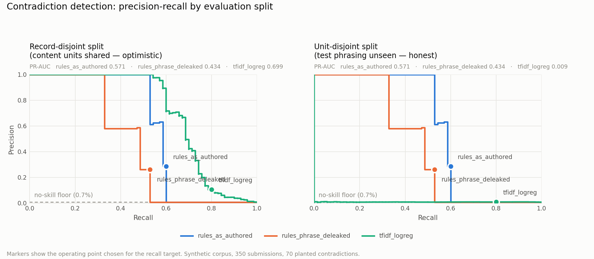

# Phase 2 — Baseline Method Comparison

Rule/keyword and TF-IDF baselines, evaluated with grouped cross-validation on two splits. Both are honest attempts: the point of the comparison is to find where a classical method genuinely fails, so that Phase 3 has something real to beat.

**This is decision support.** Every flag is advisory and every method here produces a human-readable reason alongside its score. Nothing in this phase issues or overrides a Status Determination Statement.

## The headline

On a conventional record-disjoint split, TF-IDF + logistic regression looks strong: PR-AUC **0.699** against a no-skill floor of 0.007, reaching 80% recall at 1.52 flags per submission.

On the unit-disjoint split — where no test justification's underlying proposition appears in training — the same model collapses to PR-AUC **0.009**, which is essentially the no-skill floor. The rule baseline is unchanged across the two splits at PR-AUC **0.571**, because it does not learn from the corpus and so has nothing to memorise.

**Read that as: almost all of the TF-IDF baseline's apparent performance is template memorisation.** It is not detecting contradiction; it is recognising sentences it has seen. On phrasing it has not seen, it is no better than chance. That is the single most important result in this phase, and it reframes what Phase 3 has to demonstrate — not 'beat 0.72', but 'produce any signal at all on unseen phrasing'.

## Dataset and evaluation design

| | |
|---|---|
| Prediction unit | one (submission, contradiction-pair) instance |
| Instances | 9,918 across 350 submissions |
| Positive instances | 70 |
| Positive rate | 0.71% |
| Instances per submission | 28.3 |
| Distinct content units | 140 |
| Cross-validation | 5-fold, grouped and stratified |
| Recall target | 80% |

**Accuracy is not reported anywhere in this phase.** At a 0.71% positive rate a detector that never fires scores 99.3% accuracy and finds nothing. The operational metric is **flags per submission** — precision of 0.22 means nothing to the IR35 team, whereas 'you will see roughly one flag every one or two forms' decides whether the tool gets used.

Cross-validation rather than a single holdout: a 30% holdout leaves about twenty positives, and splitting those across seven contradiction types and three subtlety levels gives cells of two or three. Out-of-fold scoring predicts all 70 out of sample.

### Why two splits

| Split | What it holds out | What it measures |
|---|---|---|
| `record` | whole submissions | the conventional split. Content units are shared, so most test phrasing has been seen in training — an **upper bound** inflated by template reuse. |
| `unit` | whole content units | no test proposition appears in training. Records straddle the split, so record-level style is not controlled — a **lower bound**, because template propositions are discrete and a novel one may share almost no vocabulary with training, whereas real phrasing varies continuously. |

Real-world performance sits between the two. Reporting only the first would have overstated the classical baseline substantially.

## Cue leakage

The lexical cues were authored in Phase 0; the contradiction text in Phase 1. Same author, same understanding of the domain, a week apart — so they overlap. **34 of 105 planted contradiction units (32%) contain a cue verbatim**, and 45 of 126 cues (36%) appear somewhere in the generated text, across 19 pairs.

The worst cases are straightforwardly a copied sentence:

- `p_4_05_right_to_reject` — cue `"we specifically need this individual"` against planted text *"we specifically need this individual, nobody else has the expertise"*
- `p_4_05_right_to_reject` — cue `"equivalent skills and experience"` against planted text *"we would need to be satisfied that anyone sent had equivalent skills and experience before"*
- `p_4_31_other_clients` — cue `"left their previous employer"` against planted text *"they left their previous employer in March and set up the company shortly afterwards, so t"*

So the rule baseline is run three ways rather than once:

| Variant | Rule | Reading |
|---|---|---|
| `rules_as_authored` | every cue | upper bound — what a keyword list achieves when its phrasing happens to match the data |
| `rules_phrase_deleaked` | cues of 3+ words appearing verbatim are removed | copied phrasing stripped, domain vocabulary kept. **The number to quote.** |
| `rules_vocab_stripped` | every verbatim-matching cue removed | pessimistic floor. Strips legitimate domain terms too, so it is close to tautological — reported for completeness, not as an estimate |

The three-word line is a judgement, stated so it can be disagreed with and recomputed. The gap between the first two variants is the useful number: it measures how much the baseline depends on having seen the exact phrasing.

## Results

### `record` split

| Method | PR-AUC | ROC-AUC | Macro-F1 | Brier | Threshold | Recall | Precision | Flags/form | Missed |
|---|---|---|---|---|---|---|---|---|---|
| `rules_as_authored` | 0.571 | 0.797 | 0.690 | 0.0048 | 0.354 | **0.60** | 0.286 | 0.42 | 28 |
| `rules_phrase_deleaked` | 0.434 | 0.761 | 0.671 | 0.0056 | 0.354 | **0.53** | 0.261 | 0.41 | 33 |
| `rules_vocab_stripped` | 0.035 | 0.514 | 0.526 | 0.0069 | 0.389 | **0.03** | 1.000 | 0.01 | 68 |
| `tfidf_logreg` | 0.699 | 0.949 | 0.580 | 0.0037 | 0.073 | **0.80** | 0.105 | 1.52 | 14 |

- `rules_as_authored`: Recall target 80% is unreachable at any threshold; the best achievable is 60%. Reported at that point.
- `rules_phrase_deleaked`: Recall target 80% is unreachable at any threshold; the best achievable is 53%. Reported at that point.
- `rules_vocab_stripped`: Recall target 80% is unreachable at any threshold; the best achievable is 3%. Reported at that point.

### `unit` split

| Method | PR-AUC | ROC-AUC | Macro-F1 | Brier | Threshold | Recall | Precision | Flags/form | Missed |
|---|---|---|---|---|---|---|---|---|---|
| `rules_as_authored` | 0.571 | 0.797 | 0.690 | 0.0048 | 0.354 | **0.60** | 0.286 | 0.42 | 28 |
| `rules_phrase_deleaked` | 0.434 | 0.761 | 0.671 | 0.0056 | 0.354 | **0.53** | 0.261 | 0.41 | 33 |
| `rules_vocab_stripped` | 0.035 | 0.514 | 0.526 | 0.0069 | 0.389 | **0.03** | 1.000 | 0.01 | 68 |
| `tfidf_logreg` | 0.009 | 0.598 | 0.297 | 0.1162 | 0.020 | **0.80** | 0.009 | 16.90 | 14 |

- `rules_as_authored`: Recall target 80% is unreachable at any threshold; the best achievable is 60%. Reported at that point.
- `rules_phrase_deleaked`: Recall target 80% is unreachable at any threshold; the best achievable is 53%. Reported at that point.
- `rules_vocab_stripped`: Recall target 80% is unreachable at any threshold; the best achievable is 3%. Reported at that point.

### ROC-AUC is reported but should not be read

The brief asks for it, so it is in the table. At this class balance it is misleading: the false-positive rate barely moves because the negative class is enormous, so every method looks respectable. The `unit` split makes the point — TF-IDF holds a ROC-AUC around 0.6 while its PR-AUC sits on the no-skill floor. PR-AUC and flags-per-form are the metrics that describe what a reviewer experiences.

## Where each method fails

**These breakdowns are on the `record` split**, because it is the only split with enough positives per cell to break down at all. That means the TF-IDF column is the *memorising* regime: its per-type numbers describe how well it recognises propositions it has already seen, and they do not transfer to unseen phrasing. The rule columns are split-independent and can be read at face value. Compare the rule variants against each other freely; compare them against TF-IDF only with that asymmetry in mind.

### Recall by contradiction type (`record` split, at the chosen operating point)

| Method | category mismatch | direct negation | hedged non support | named person dependency | reimbursement flip | scope qualification | temporal inconsistency |
|---|---|---|---|---|---|---|---|
| `rules_as_authored` | 0.89 (8/9) | 0.80 (8/10) | 0.20 (2/10) | 0.40 (4/10) | 0.60 (6/10) | 0.73 (8/11) | 0.60 (6/10) |
| `rules_phrase_deleaked` | 0.89 (8/9) | 0.60 (6/10) | 0.00 (0/10) | 0.40 (4/10) | 0.60 (6/10) | 0.64 (7/11) | 0.60 (6/10) |
| `rules_vocab_stripped` | 0.11 (1/9) | 0.00 (0/10) | 0.00 (0/10) | 0.00 (0/10) | 0.00 (0/10) | 0.00 (0/11) | 0.10 (1/10) |
| `tfidf_logreg` | 0.78 (7/9) | 0.80 (8/10) | 0.70 (7/10) | 1.00 (10/10) | 0.70 (7/10) | 0.73 (8/11) | 0.90 (9/10) |

The rule baseline's weakest types are the predicted ones. `hedged_non_support` recall is **0.20** — a keyword list cannot detect the *absence* of commitment, because there is no phrase to match; the contradiction is that the manager selected a definite option and then wrote something that fails to support it. `named_person_dependency` is **0.40** despite being the highest-priority pair in the set, because the dependency is usually implied rather than stated in listed vocabulary.

These two types are the specific place a transformer should earn its keep. If Phase 3 does not improve on them, the method comparison has a real finding to report rather than a foregone conclusion.

`rules_vocab_stripped` scoring near zero on every type is the tautology warned about above, visible in full: remove every term that occurs in the data and a lexical method has nothing left to match. It is in the table so the floor is not mistaken for a result.

### Recall by subtlety (`record` split)

| Method | level 1 | level 2 | level 3 |
|---|---|---|---|
| `rules_as_authored` | 0.65 (15/23) | 0.65 (22/34) | 0.38 (5/13) |
| `rules_phrase_deleaked` | 0.57 (13/23) | 0.56 (19/34) | 0.38 (5/13) |
| `rules_vocab_stripped` | 0.00 (0/23) | 0.03 (1/34) | 0.08 (1/13) |
| `tfidf_logreg` | 0.83 (19/23) | 0.76 (26/34) | 0.85 (11/13) |

Level 1 is blatant, level 2 needs reading, level 3 needs domain knowledge — the form's own cost exclusions, or the case law. The rule baseline degrades sharply at level 3, which is the expected shape: those are the contradictions a busy reviewer misses too, and they are the ones the tool most needs to catch.

### Recall by engagement archetype (`record` split)

| Method | it contractor | research consultant | technical trades | visiting lecturer |
|---|---|---|---|---|
| `rules_as_authored` | 0.74 (17/23) | 0.56 (10/18) | 0.54 (7/13) | 0.50 (8/16) |
| `rules_phrase_deleaked` | 0.65 (15/23) | 0.44 (8/18) | 0.54 (7/13) | 0.44 (7/16) |
| `rules_vocab_stripped` | 0.09 (2/23) | 0.00 (0/18) | 0.00 (0/13) | 0.00 (0/16) |
| `tfidf_logreg` | 0.83 (19/23) | 0.78 (14/18) | 0.69 (9/13) | 0.88 (14/16) |

A first look at the disparity question Phase 4 takes up properly. Cell counts here are small — single figures per archetype — so differences should be read as a direction to investigate, not as an effect.

The direction to investigate is already visible: the rule baseline catches 74% of contradictions on it contractor engagements and 50% on visiting lecturer ones. That is the shape predicted in Phase 1 — the borderline cases cluster in teaching engagements, where autonomy of method sits alongside a fixed timetable — and if it survives Phase 4 with larger cells it is a fairness finding, not a tuning problem. A tool that protects one category of worker better than another is a governance issue before it is a metric.

### Recall by writing register (`record` split)

| Method | hedged | terse | verbose |
|---|---|---|---|
| `rules_as_authored` | 0.67 (16/24) | 0.59 (16/27) | 0.53 (10/19) |
| `rules_phrase_deleaked` | 0.50 (12/24) | 0.56 (15/27) | 0.53 (10/19) |
| `rules_vocab_stripped` | 0.00 (0/24) | 0.04 (1/27) | 0.05 (1/19) |
| `tfidf_logreg` | 0.79 (19/24) | 0.81 (22/27) | 0.79 (15/19) |

Register here is confounded with archetype, because archetypes carry different register mixes. Phase 4's style-invariance test resolves that by re-rendering the *same* engagement in all three registers, which this breakdown cannot do.

## Runtime

| Method | Total fit time across folds |
|---|---|
| `rules_as_authored` | 0.0s |
| `rules_phrase_deleaked` | 0.0s |
| `rules_vocab_stripped` | 0.0s |
| `tfidf_logreg` | 26.6s |

Recorded because the deployment assumption is local-only: a method that needs a GPU to be practical is a different proposition for the University than one that runs on a laptop.

## Method choices, and what was rejected

**Rule baseline.** Pair cues, contradiction-family lexicons grouped by type and restricted to the IR35 tests where they apply, structural regexes for rate shapes, and negation handling with a four-token window. Negation matters more than it looks: without it the matcher fires on *"we do not require them on site"*, which is evidence **for** the answer. Skipping it is the usual way a keyword baseline becomes a strawman.

*Rejected:* reusing the structured-answer weights from the labelling engine. That would have made Phase 2 grade the generator against its own logic. The rule baseline reads free text only, and shares no coefficients with `config/ir35_weights.yaml`.

**TF-IDF baseline.** Word 1-2 grams over the answer and text together, character 3-5 grams for robustness to the terse register, and explicit interaction features crossing free-text tokens with the answer's polarity and IR35 test. The interaction block is the important part: a contradiction is not a property of the text alone. *"We would need to approve any substitute"* is consistent with "Yes, we have a right to reject" and contradicts "No". Without the cross, a linear model can only learn "these words are suspicious", which is the wrong hypothesis class.

*Rejected:* per-pair models. Seventy positives across thirty-one pairs is two each. One pooled model with pair identity as a feature is the only defensible choice at this scale.

*Rejected:* tuning the threshold to maximise F1. The objective is a stated recall level at the least reviewer burden that achieves it. A missed contradiction reaches HMRC as a determination made without the reasonable care the off-payroll rules require; a false flag costs a reviewer half a minute. F1 would trade away recall to buy precision, which is the wrong trade here.

## Limitations

1. **The rule baseline cannot reach the recall target at all.** Its ceiling is reported in the tables above. That is a property of lexical matching, not of tuning — there is no threshold at which it finds what it has no vocabulary for.
2. **TF-IDF's record-split score is not a performance estimate.** It is what memorising 140 content units gets you. The unit-split figure is closer to honest and is itself pessimistic.
3. **The corpus labels came from a rule engine** (`config/ir35_weights.yaml`). The contradiction labels are independent of it — they are planted, not derived — so this phase is not circular in the way a *status* classifier would be. But no status classification is attempted here, and that is why.
4. **Small cells.** Per-type recall rests on nine to eleven positives per type. Differences of one or two cases are noise.
5. **Calibration is poor for the rule baseline by construction** — its scores are a squashed weighted count, not a probability. The Brier scores reflect that. Phase 4's calibration analysis is where this gets treated properly.
6. **Register and archetype are confounded** in the breakdowns above.

## What Phase 3 has to beat

| Target | Value |
|---|---|
| Rule baseline, PR-AUC (split-independent) | 0.571 |
| Rule baseline, recall ceiling | 0.60 |
| Rule baseline de-leaked, PR-AUC | 0.434 |
| TF-IDF on unseen phrasing, PR-AUC | 0.009 |

The bar that matters is the `unit` split: a method that generalises to phrasing it has not seen. A cross-encoder NLI model should, because it reasons over the relationship between two texts rather than over a learned vocabulary — but that is a hypothesis, and Phase 3 exists to test it, not to confirm it.

